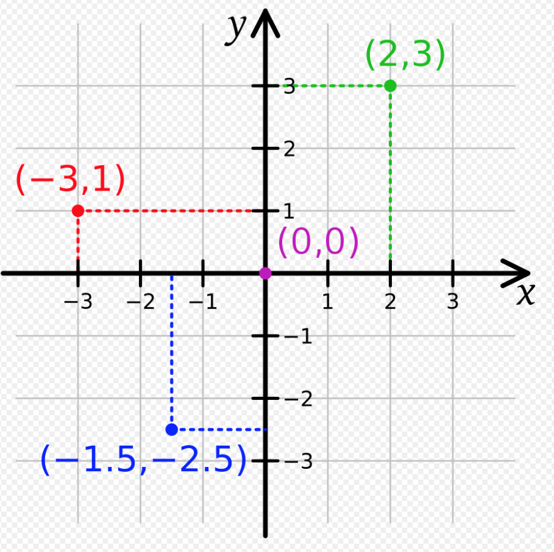
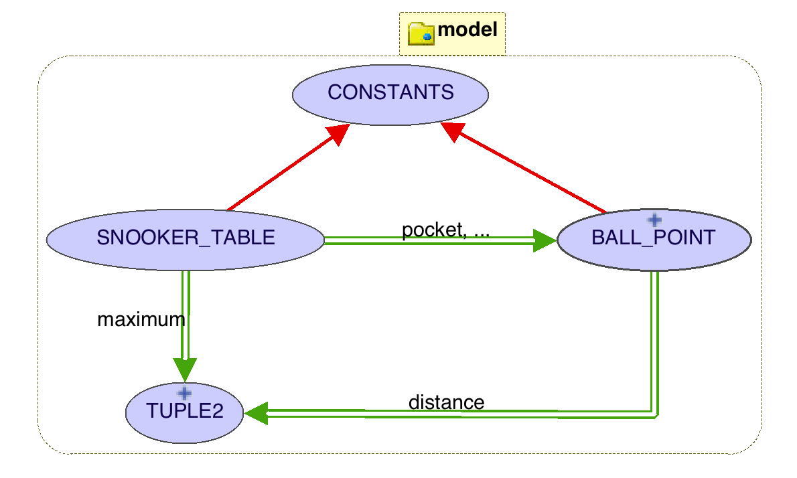

# Lab0: Model a simplified Snooker Table

Complete this introductory Lab0 by the end of the first week. You **must** submit to ensure that you are ready for Lab1. There is a lot to learn in Week1, but you also have more time to invest. 

## Your approach to assigned work and "learning"
There are some fairly blunt suggestions about how to approach this course (see [Leamnson, 2002](http://www.eecs.yorku.ca/~eiffel/pdf/Learning-FirstJob.pdf)). 

In Lab0, you are given a mark (for your own benefit) -- but it is not weighted as part of your final grade. You can submit as many times as you wish. Each time we check your submision and provide you with feedback. 

The Lab0 challenge below is simple -- compared to what you can expect later. If you do not receive 100% by the end of Week1 on Lab0, then that may indicate that you need to take more OO programminmg and data structure courses -- before doing this course. It does mean that you are not yet ready for the main  bulk of the work coming very soon down the pipeline. 

Expect Lab0 to take a large chunk of time (more time than available in the scheduled lab session). Complete most of the work on your own before your scheduled lab session. Attend every scheduled lab seesion and use it to get help from the teaching assistants and lecturers.

Many resources are available to you including textbooks, tutorials and videos, office hours, scheduled laboratories -- and the lectures. 

But, it is up to you to become an **active** participant in the course. The resources available to you can only do so much. Learning is not something that just "happens" to you -- it is something that you do to yourself. You cannot be "given" learning, nor can you be forced to do it. The most brilliant and inspired teacher cannot "cause" you to learn. Only you can do that. A basic assumption is that you want to understand, remember and apply the material in this course (not just to pass the exam). Without that desire, nothing will work. This requires at least 10 hours of your focused effort every week (including lectures and lab sessions).  

Assigned work is cumulative -- one lab leads to the next.  Omitting any one Lab is likely to be a very serious mistake. Expect the workload to be high; however, asignments (i.e. labs, labtests and the Project) are carefully paced, if you keep up active work and focus each week. 

Your attitude will influence how you react to assigned work. Inexperienced students view assigned work as paying dues, or taxes, or as mere busywork that instructors insist on out of habit. But that is to squander an excellent learning opportunity. Experienced students see the assigned work as something to be used as a clue from an instructor as to what is important enough to spend time learning. In most cases, assigned work is a solid, meaty chunk of what’s signficant. Don’t just do it with minimal effort and thought, use it to learn something new.

Getting full marks in Lab0 -- where it is your own work -- indicates that you have adopted a productive active learning mode which is essential that you maintain for the rest of this course. 

## Lab0 challenge

(Wikipedia)

In this Lab, you design a **model** of a simplified snooker table with two balls one **blue**  and one **red**. The table is 177.8cm (width, x-axis) by 356.9cm (height, y-axis). The balls may start at any position on the table. A cue stick may give an impulse to a ball which causes it to move on the table by some **delta** (finite increment). Each ball may only be given an impulse which does not cause it collide with the other ball, or move off the table. 

Our snooker balls are so tiny that we may assume that a ball can be represented by a single point on the Cartesian axis. The bottom-left of the table is at the origin [0, 0] and top-right pocket terminiates the game when any ball reaches it.


(Wikipedia)

1. It is essential that any impulse that is out of bounds causes a contractual exception to be raised (via preconditions, posconditions and class invariants). 

2. You must use **eiffel-new** to create a new void safe project `snooker`. [**Aside**: Such projects automatically include various libraries such as Gobo (e.g. to do regular expressions) and Mathmodels (mathemtrical sets, functions relations etc.). You will eventually learn more about these libraries. **end aside**]

3. You are provided with precise specifications (via contracts) but not the implementation. If you understand the specifications then you know what must be implemented. 

4. We provide you with a suite of unit tests that your submision must pass. You should also add tests of your own tio satsify yourself that your design is correct.

5. In this course, all your submitted work **must** compile and pass either unit or acceptance tests. We use these tests to grade your submissions. If your submision does not compile, or it compiles but it crashes (with unexpected exceptions), or it does not terminate, or it terminates with incorrect output, then you cannot expect to achieve a passing grade. It is thus up to you to ensure that your submisions satisfy the requirements. You must get all unit tests to run with a green bar. Thus, submit as many times as you wish. We check each submission and provide you with feedback.


You submit a folder `snooker` with the following file structure:


 

## Design

Below we show the architecture of our suggested design of cluster `model` as a BON class diagram. This diagarm was constrcuted automatically by the EiffelStudio IDE from text of the classes. For example, the text of class `TUPLE2` is in a file `tuple2.e`. 



We provide you with the complete text of class `CONSTANTS` and `TUPLE2`. You will need to complete class `SNOOKER_TABLE` (containing the blue and red balls) and class `BALL_POINT` (which represents positions of a ball on a snooker table). 

```eiffel
class CONSTANTS feature

	length: DECIMAL
			-- length of snooker table
		once -- self intializing
			Result := "356.9"
		ensure class -- static
		end

	width: DECIMAL -- 177.8
		-- width of snooker table
	
	zero: DECIMAL -- 0.0

invariant
	table-size: 
		length ~ "356.9" and width ~ "177.8"
	zeroth: 
		zero ~ zero.zero
end
```

You may use class `DECIMAl` to represent x-components and y-components of points. `length :=  "356.9"` may be used to set a precise decimal. See
class [DECIMAL](https://www.eecs.yorku.ca/~eiffel/eiffel-docs/mathmodels/decimal.html) (which is part of the Mathmodels library). Tests for class `DECIMAL` are avaible [here](https://www.eecs.yorku.ca/~eiffel/eiffel-docs/decimal/decimal_primary_operation_test.html).

## Principles and Constructs
* Use `eiffel-new` to start a project that you will eventually submit. 
* Obtain a working knowledge of Eiffel syntax and semantics. Review OO programming constructs and principles in the context of the Eiffel language and method. 
* Use the IDE to create classes in clusters and browse code
* Use the IDE and ESpec to run unit testing. Start with a few tests and then expand the set of tests and keep regression testing as you implement features.
* The program text does not just contain implementation code. It also contains  **contracts** (preconditions, postconditions and class invariants) as specifications and must implement these specifications of features. Contracts are **predicates** so you will need to brush up on your logic (see Logic-101). Implementations are checked at runtime for correctness. 
* Understand **command-query** separation principle. 
* Use client-supplier (associations) and inheritance. View and understand BON class diagrams (similar to UML class diagrams). 
* You use reference equality (`=`) and value equality (`is_equal` and `~`) and `COMPARABLE`.
* Use class `ARRAY[G]` where 	`G` is a generic parameter. [**Aside**: In Lab1 you will also use `LIST[G]` and later `HASH_TABLE[V,K]`. Of course you must know about stacks and queues].
* Use a library class `DECIMAL`
* Use `once` and `convert` constructs
* See the **across** iteration for quantifiers in contracts. We will soon discus the iteration **design pattern** (and many others).  

The textbook OOSC2 explains the software design **rationale** for most of these concepts (albeit some of the syntax is obsolete). The textbook "Touch of Class" has the more up-to-date syntax.

## Additional Exercises for Reflection (not for submision)

1. note that `impules_red` and `impulse_blue` share a similar structure. Is there some way to use procedural abstraction so that one command can be used to do either?

2. Do you  understand some of concepts used such as design by contract (preconditions, postconditions, class invariants), client-supplier and inheritance relations bteween classes, the difference between a class and an object, unit testing using ESpec, the use of machinery with keywords **convert**,  **once**, **ensure class**, etc. 

3. What does it mean when we say that a **class** is a partially implemented **abstract data type**, with inheritance?
