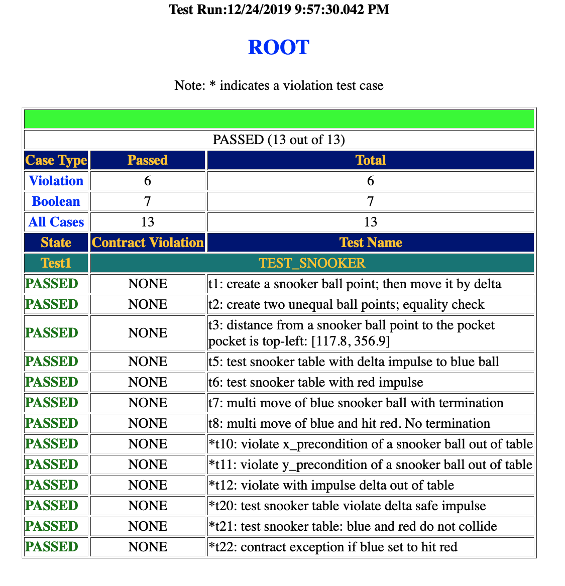
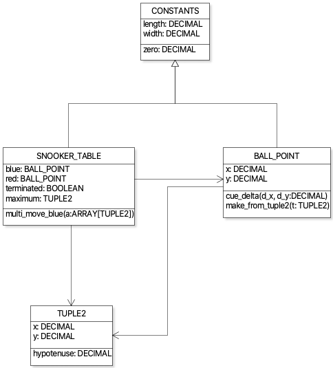
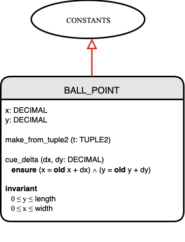

Resources for Lab0 below:

* [Lab0-Prep.pdf](Lab0-Prep.pdf). Use the EiffelStudio to compile and unit test programs.  
* [Eiffel-101](https://www.eecs.yorku.ca/~eiffel/pdf/Eiffel-101.pdf). 
* [Useful Videos](https://www.youtube.com/playlist?list=PL5dxAmCmjv_6r5VfzCQ5bTznoDDgh__KS). See the first one in the playlist. 

# Lab0: Model Movement of Balls on a Snooker Table

Complete this introductory Lab0 by the end of the first week. You **must** submit to ensure that you are ready for Lab1. There is a lot to learn in Week1, but you also have more time to invest. In this Lab you construct and test a very simple **model** of the movements of balls on a snooker table following a Design by Contract (DbC) approach. You will need to learn a variety of tools, methods and **specification** language constructs for documenting designs above the code level.  

## Your approach to assigned work and "learning"
There are some fairly blunt suggestions about how to approach this course (see [Leamnson, 2002](http://www.eecs.yorku.ca/~eiffel/pdf/Learning-FirstJob.pdf)). 

In Lab0, you are given a score purely for your own benefit (it is not weighted as part of your final grade). You can submit as many times as you wish. Each time we check your submission and provide you with feedback. Once submission closes we will grade it. 

The Lab0 challenge below is simple -- compared to what you can expect later. If you do not score 100% by the end of Week1 on Lab0, then that may indicate that you need to take more OO programming and data structures courses -- before doing this course. It does mean that you are not yet ready for the main  bulk of the work coming very soon down the pipeline. 

Expect Lab0 to take a large chunk of time (more time than available in the scheduled lab session). Complete most of the work on your own before your scheduled lab session. Attend every scheduled lab session and use it to get help from the teaching assistants and lecturers.

Many resources are available to you including textbooks, tutorials and videos, office hours, scheduled laboratories -- and the lectures. 

But, it is up to you to become an **active** participant in the course. The resources available to you can only do so much. Learning is not something that just "happens" to you -- it is something that you do to yourself. You cannot be "given" learning, nor can you be forced to do it. The most brilliant and inspired teacher cannot "cause" you to learn. Only you can do that. A basic assumption is that you want to understand, remember and apply the material in this course (not just to pass the exam). Without that desire, nothing will work. This requires at least 10 hours of your focused effort every week (including lectures and lab sessions).  

Assigned work is cumulative -- one lab leads to the next.  Omitting any one Lab is likely to be a very serious mistake. Expect the workload to be high; however, assignments (i.e. labs, labtests and the Project) are carefully paced, if you keep up active work and focus each week. 

Your attitude will influence how you react to assigned work. Inexperienced students view assigned work as paying dues, or taxes, or as mere busywork that instructors insist on out of habit. But that is to squander an excellent learning opportunity. Experienced students see the assigned work as something to be used as a clue from an instructor as to what is important enough to spend time learning. In most cases, assigned work is a solid, meaty chunk of what’s significant. Don’t just do it with minimal effort and thought; use it to learn something new.

Getting full marks in Lab0 -- where it is your own work -- indicates that you have adopted a productive active learning mode which is essential for you to maintain for the rest of this course. 

---

## Lab0 challenge 

Do this Lab together with the active study of [Eiffel-101](https://www.eecs.yorku.ca/~eiffel/pdf/Eiffel-101.pdf). 


(Wikipedia)

In this Lab, you design a **model** of the movement of two balls (one **blue**  and one **red**) on a snooker table. The table is 177.8cm (width, x-axis) by 356.9cm (height, y-axis). The balls may start at any position on the table. A cue stick may give an impulse to a ball which causes it to move on the table by some **delta** (finite increment). Each ball may only be given an impulse which does not cause it collide with the other ball, or move off the table. 

Our snooker balls are so tiny that we may assume that a ball can be represented by a single point on the Cartesian axis. The bottom-left of the table is at the origin [0, 0] and top-right pocket terminates the game when any ball reaches it.


(Wikipedia)

1. It is essential that any impulse that is out of bounds causes a contract violation to occur (via preconditions, posconditions and class invariants). 

2. You must use **eiffel-new** to create a new void safe project `snooker`. [**Aside**: Such projects automatically include various libraries such as Gobo (e.g. to do regular expressions) and Mathmodels (mathematical sets, functions relations etc.). You will eventually learn more about these libraries. **end aside**]

3. You are provided with precise specifications (via contracts) but not the implementation. If you understand the specifications then you know what must be implemented. 

4. We provide you with a suite of unit tests that your submission must pass. You should also add tests of your own to satisfy yourself that your design is correct.


5. **N.B.** In this course, all your submitted work **must** compile and pass either unit or acceptance tests. We use these tests to grade the **correctness** of your design submissions. If your submission does not compile, or it compiles but it crashes (with unexpected exceptions), or it does not terminate, or it terminates with incorrect output, then you cannot expect to achieve a passing grade. It is thus up to you to ensure that your submissions satisfy the requirements. At the very least, you must get all the unit tests we provide to run with a green bar of success. In addition, always add tests of your own. Submit as many times as you wish before the deadline. We check each submission and provide you with some feedback.

### ESpec Unit Testing


You submit a folder `snooker` with the following file structure:

### Folder structure of your submission


## Design

Below we show the **architecture** (relationship between the classes) of our suggested design of cluster `model` as a BON class diagram. This diagram was constructed automatically by the EiffelStudio IDE from text of the classes. For example, the text of class `TUPLE2` is in a file `tuple2.e`. 


* We provide you with the complete text of class `CONSTANTS` and `TUPLE2`. 
* You will need to complete class `SNOOKER_TABLE` (containing the blue and red balls) and class `BALL_POINT` (which represents positions of a ball on a snooker table). 
* The single red arrow represents an inheritance relationship. The double green arrow a client-suppler relationship (called an association in UML). The direction of the arrows describes dependency (`SNOOKER_TABLE` depends on `TUPLE2`, but not *vice versa*). 

The EiffelStudio IDE can also generate a UML diagram. Below we use a drawing tool to show the UML. The notation in a UML class is to have one section for attributes and below that for methods. Perplexingly, UML does not adopt the Command-Query Separation principle. 



In later Labs, you use the [draw.io](http://seldoc.eecs.yorku.ca/doku.php/eiffel/faq/bon) to draw BON class diagrams in design documents. BON diagrams allow us to document specifications. Here is an example:



**Reflection Question**: (1) Can you tell from the BON class diagram which features are commands and which are queries? (2) The design decision we made above is that class `BALL_POINT` uses class `TUPLE2`. Should that relationship be inheritance rather client-supplier?

### Modularity and the Superman Anti-Pattern

In object-oriented programming, a **Superman Class** is one that knows and does too much. It is an example of an Anti-Pattern, one that does not quite "smell" right. 

We could code the snooker table as a single class with everything in it: the size of the table, the position of the balls as floats, their colours, the way they move, etc. This example is small and we could get away with it. 

But if others are to read, understand and maintain our code, it's not a great idea. 

We may want to eventually deal with more than 2 balls, and to support better physics and a proper game of snooker with multiple players and keeping track of player scores. As our application grows this Superman class also keeps growing and growing, and we might end up with a monstrous class with thousands and thousands of lines of incomprehensible spaghetti code. 

 Wikipedia 

#### Information Hiding

A common design technique is to decompose a large problem into several smaller problems (a divide and conquer strategy) and to create solutions for each of them. Once the smaller problems are solved, the big problem as a whole has been solved by composition of the smaller problems in a loosely coupled way -- a way in which each module makes use of little (or no) knowledge of the descriptions of the other modules. Then we can change the implementation of a module (keeping its interface to other modules small and invariant) with no effect on other modules. 

Therefore, a given module that is a solution to a small problem need only know about itself, and the public interfaces of other modules that it uses. So modules (or, in OO, classes) allow us to follow a policy of **separation of concerns**. A class (i.e. a module of the system) should hide a design decision from the other classes of the application. This is one example of **information hiding**. 


### Design Decision: What is a point, coordinate or position on a snooker table?

How will we represent the position of a ball on the snooker table?


The blue and red balls each have a position as point [x,y] on the Cartesian plane.  Mathematically, a point is a 2-tuple. So we might consider a class BALL_POINT which represents such a coordinate.

```eiffel
class BALL_POINT feature  -- rejected design
	position: TUPLE[x: REAL; y:REAL] -- a 2-tuple, i.e. an ordered pair
	 
	cue_delta (delta_x, delta_y: REAL)
		-- move ball to new point [position.x + delta_x, position.y + delta_y]
end
```

What we see is the need for two different kinds of 2-tuples: (a) for a **point** on the coordinate plane (possibly bounded by the table dimension) and (b) a **δ-increment** (delta-increment) representing the effect of an impulsive force of cue to a snooker ball. Points might have to be constrained within the positive dimensions of a snooker table, but force impulse increments might be negative.  

We might declare each variable or routine argument with type `TUPLE[x: REAL; y:REAL]`. But what if we need to compare two instances of this type? Or show that two instances have the same value? (equality of `x` and `y` components). Or calculate the size of the hypotenuse of an impulse?

So we need an Abstract Data Type (ADT) for arbitrary 2-tuples. So our first design decision is to describe a new type TUPLE2 in which we will encapsulate both data and routines (or methods):
#### Interface view of class TUPLE2

```eiffel
class TUPLE2 inherit
	COMPARABLE
		redefine is_equal end
create 
	make,
	make_from_tuple
	
feature -- Queries

	x: DECIMAL

	y: DECIMAL
	
	hypotenuse: DECIMAL
		ensure Result ~ (x * x + y * y)
	
feature -- Equality

	is_equal (other: like Current): BOOLEAN
			-- Is current tuple equal to 'other'?
		ensure then
				Result = (x ~ other.x and then y ~ other.y)

	is_less alias "<" (other: like Current): BOOLEAN
			-- Is current object less than `other`?
		ensure then
				Result = (hypotenuse < other.hypotenuse)
invariant
		non_negative: 
			hypotenuse >= hypotenuse.zero
end 
``` 

To use class `TUPLE2` we might describe moves of the blue ball by:

```eiffel
class SNOOKER_TABLE feature
	blue, red: BALL_POINT
	
	maximum: detachable TUPLE2
		-- impulse
	
	multi_move_blue(a: ARRAY[TUPLE2])
			-- make many blue ball moves, if possible,
			-- and save the delta of the maximum move
		ensure 
			(attached maximum) implies (∀δ ∈ a: maximum ≥ δ)
end
```

Query `maximum`, for example, returns the maximum effect of an impulse in a multi-move of the blue ball on the snooker table. Command `multi_move_blue` has an array of moves to make. 

Note that we follow the **Command-Query** separation principle (query routines should not produce abstract side-effects); thus `blue`, `red`, `maximum` are queries while `multi_move_blue` is a command. Queries do not change the state of an object. For the important rationale behind this principle see OOSC2 page 751, 759. 

Attributes such as `blue` and `red` are public; they do not need to be made private with "getters. This is because other objects can read public attributes of instances of SNOOKER_TABLE, but cannot write to them (e.g. another class may not have `table.new_blue := [40.8, 16.2]`). 

We have set up our projects so that by default variables are of **attached** type. When a variable is declared of an attached type, the compiler will prevent it from being set to `Void` or set to anything that can be set to Void. In class SNOOKER_TABLE, query routine `maximum` is declared **detachable**, meaning that it may be set to `Void`. At compile time, the compiler will ensure that there are no null pointer exceptions due to void safety, and there are thus certain constructs you must use with detachable types. Read more about void safety over [here](https://www.eiffel.org/doc/eiffel/Void-safe_programming_in_Eiffel). Void safety is an important mechanism for designing reliable softer and many programming languages now support this property. 

We have equipped class `TUPLE2` with the following properties:

* Instances of class `TUPLE2` can be used to store a coordinate point as well as a delta-increment; the x and y components are unbounded (so can also be negative).
* Another design decision is to use the arbitrary precision arithmetic class `DECIMAL` rather than the floating point class  `REAL`. This also means that the postcondition of query `hypotenuse` is a precise `Result ~ (x * x + y * y)`. See the postcondition **ensure** clause. Floating point arithmetic is not arbitrary precision -- so we cannot write `Result = (x * x + y * y)`; we would need to bound the result within some epsilon. 
* For class DECIMAL we use the `~` (tilde) notation for value equality (defined by `is_equal`). 
* TUPLE2 inherits the **deferred** query routine `is_less alias "<" (other: like Current): BOOLEAN` from class `COMPARABLE`. This query must be **effected** in `TUPLE2`. The postcondition specifies what result must be delivered.  We must also redefine `is_equal `(inherited from `COMPARABLE`). The class thus specifies equality of two instances and also allows them to be compared (e.g. for calculating a maximum). 
* **Specifications** (as contracts) completely and precisely describe what must be implemented by a software developer coding TUPLE2. The contracts also provide a client (e.g. `SNOOKER_TABLE`) with a completely specified interface (without the need to know any implementation details). 
* Class invariants such as  `hypotenuse >= hypotenuse.zero` must be preserved by all routines (wether query routines or command routines). 
* Class `TUPLE2` encapsulates some design decisions that make it a useful module for this application. We have introduced a new and useful abstract data type. Without this type, we would need repeated copies of  convoluted code to check the equality and comparison of points and/or impulse increments. We would not have the security and correctness of the type enforced by the contractual specifications. 

You may use class `DECIMAl` to represent x-components and y-components of points. `length :=  "356.9"` may be used to set a precise decimal. See
class [DECIMAL](https://www.eecs.yorku.ca/~eiffel/eiffel-docs/mathmodels/decimal.html) (which is part of the Mathmodels library). Tests for class `DECIMAL` are available [here](https://www.eecs.yorku.ca/~eiffel/eiffel-docs/decimal/decimal_primary_operation_test.html). Unit Tests are important not just for checking the correctness of classes, but they also document how to use the class. 

#### Class CONSTANT

```eiffel
note
	description: "Snooker Table constants for a table 356.9cm x 177.8cm"
	
class CONSTANTS feature

	length: DECIMAL
			-- length of snooker table
		once -- self intializing
			Result := "356.9"
		ensure class -- static
		end

	width: DECIMAL -- 177.8
		-- width of snooker table
	
	zero: DECIMAL -- 0.0

invariant
	table-dimension: 
		length ~ "356.9" and width ~ "177.8"
	zeroth: 
		zero ~ zero.zero
end
```


## Principles and Constructs

You now have enough information to complete the Lab, of course using the various resources you have been provided with. As you do the Lab, try to understand and apply the following design tools, principles, and constructs. 

* Use `eiffel-new` ([manuals](http://seldoc.eecs.yorku.ca/doku.php/eiffel/faq/eiffel-new)) to start a project that you will eventually submit. 
* Obtain a working knowledge of Eiffel syntax and semantics. Review OO programming constructs and principles in the context of the Eiffel language and method. 
* Use the IDE to create classes in clusters and browse code
* Use the IDE and ESpec to run unit testing. Start with a few tests and then expand the set of tests and keep regression testing as you implement features.
* The program text does not just contain implementation code. It also contains  **contracts** (preconditions, postconditions and class invariants) as specifications and must implement these specifications of features. Contracts are **predicates** so you will need to brush up on your logic (see Logic-101). Implementations are checked at runtime for correctness. 
* Understand **command-query** separation principle. 
* Use client-supplier (associations) and inheritance. View and understand BON class diagrams (similar to UML class diagrams). 
* You use reference equality (`=`) and value equality (`is_equal` and `~`) and `COMPARABLE`.
* Use class `ARRAY[G]` where 	`G` is a generic parameter. [**Aside**: In Lab1 you will also use `LIST[G]` and later `HASH_TABLE[V,K]`. Of course you must know about stacks and queues].
* Use a library class `DECIMAL`
* Use `once` and `convert` constructs
* See the **across** iteration for quantifiers in contracts. We will soon discus the iteration **design pattern** (and many others).  

The textbook OOSC2 explains the software design **rationale** for most of these concepts (albeit some of the syntax is obsolete). The textbook "Touch of Class" has the more up-to-date syntax.

## Additional Exercises for Reflection (not for submission)

1. note that `impules_red` and `impulse_blue` share a similar structure. Is there some way to use procedural abstraction so that one command can be used to do either?

2. Do you  understand some of concepts used such as design by contract (preconditions, postconditions, class invariants), client-supplier and inheritance relations between classes, the difference between a class and an object, unit testing using ESpec, the use of machinery with keywords **convert**,  **once**, **ensure class**, etc. 

3. What does it mean when we say that a **class** is a partially implemented **abstract data type**, with inheritance?
