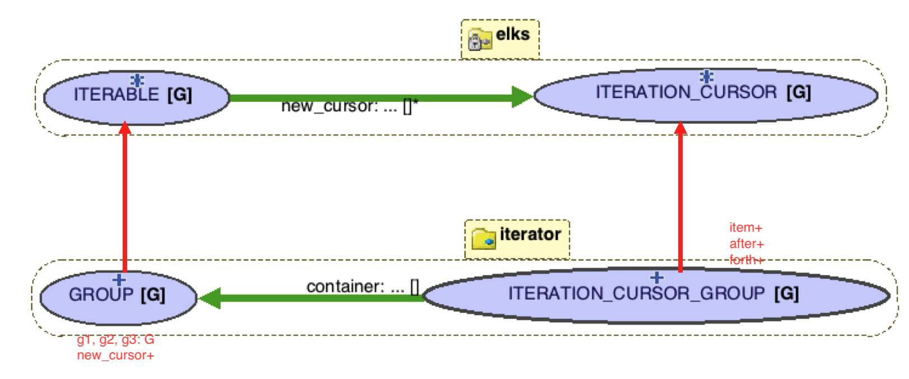

# Iterator Design Pattern

The iterator pattern is a design pattern that provides a way to access the elements of an aggregate object (collection or container) sequentially without exposing its underlying representation. An iterator is used to traverse a container and access the container's elements in different ways (see **loop**, **some** and **all**) and at different times. For example, we might want to traverse a list in different ways, without bloating the list interface with traversal operations.  One might also need to have more than one traversal pending on the same list. 

The Iterator pattern lets you do all this. The key idea is to take the responsibility for access and traversal out of the aggregate object and put it into an Iterator object that defines a standard traversal protocol.

Below is the simplest possible example of the application of the pattern to a collection (class GROUP[G] with generic parameter G) with only 3 elements 



```eiffel
class ROOT create 
   make
feature
   g: GROUP[REAL]  -- group of 3 real numbers

	make
			-- Run application
		local
			b: BOOLEAN
		do
			print("%NStart iterator tests ...%N")
			print("--as--%N")
			create g.make(1.1, 2.2, 3.3)

			-- all
			b := across g as cr all cr.item >= 2.3 end
			check not b end -- should succeed

			--some
			b := across g as cr some cr.item >= 2.3 end
			check b end

			-- loop
			across g as cr loop
				print(cr.item.out)
				io.new_line
			end

			-- is
			print("--is--%N")
			across g is r loop
				print(r.out)
				io.new_line
			end

			print("Iterator tests succeeded%N")
		end
end
```

Executing the above yields:

```
Start iterator tests ...
--as--
1.1
2.2
3.3
--is--
1.1
2.2
3.3
Iterator tests succeeded
```

## What problems can the Iterator design pattern solve?

The elements of an aggregate object should be accessed and traversed without exposing its representation (data structures).

* Define a separate (iterator) object that encapsulates accessing and traversing an aggregate object.
* Clients use an iterator to access and traverse an aggregate without knowing its representation (data structures).


